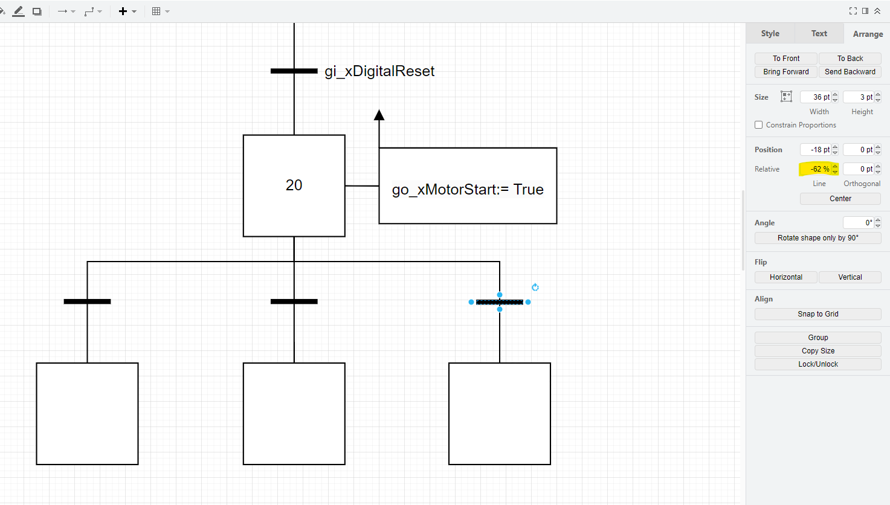

# DrawIO_GRAFCET
A Draw.io library containing simple GRAFCET symbols with reference to IEC 60848:2013.

All symbols are created using draw.io's existing standard palette.

The library can be implemented via download or through direct URL access.

Draw.io's website contains guidance for importing custom libraries in draw.io - https://www.drawio.com/blog/custom-libraries

It is recommended to add the URL of the GRAFCET.xml file to the draw.io configuration JSON, for example:
```json
{
  "defaultCustomLibraries": "Uhttps%3A%2F%2Fgithub.com%2Fratchet11243%2FDrawIO_GRAFCET%2Fblob%2Fmain%2FGRAFCET.xml"
}
```

To ensure that the library is automatically updated, you should update the "libraries"-parameter in the settings JSON, for example:

```json
{
  "language": "",
  "configVersion": null,
  "customFonts": [
    {
      "name": "Consolas"
    }
  ],
  "libraries": "general;basic;GRAFCET",
  ...
}
```

#### Branching Transitions
Currently, the implementation of transition-connectors means that transitions can be difficult to place on a vertical line, in accordance with the standard.
The solution for this is to alter the relative placement of the transition bar-object, via that object's 'Arrange'-tab, as seen below.


